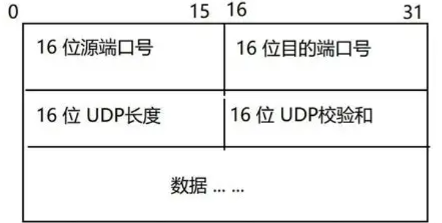

+++
title = "运输层：UDP 与 TCP 原理（上）"
date = 2026-09-21
categories = ["计算机网络"]
tags = ["计算机网络", "UDP", "运输层"]
description = "一篇讲解UDP的原理的文章"
draft = false
+++

# 运输层：UDP 与 TCP 原理（上）

最近看《计算机网络：自顶向下方法》这本书有点入迷了，所以一时起意就想写点东西😋  
为了避免一个文章过于冗长，这个博客我分为（上）和（下）两篇来写了

- [上篇](../transport-layer-UDP/index.md) 主要讲**前置知识和UDP的工作原理**
- [下篇](../transport-layer-TCP/index.md) 主要讲**TCP的工作原理**

## 前言

> 应用层的进程想要通信，但应用进程本身不关心「字节是怎么从这台机器爬到那台机器」的。
> 它只想要一个东西：**一条从我的进程到对方进程的、看起来可靠的管道**  
> 这就是运输层干的活

---

## 相关词条

- 网络层
  - IP：Internet Protocol，网际协议  
  它既是一种传输协议，也是定位协议
- 传输层
  - TCP：Transmission Control Protocol，传输控制协议
  - UDP：User Datagram Protocol，用户数据报协议
  - MSS：Maximum Segment Size，最大报文段长度
  - MTU：Maximum Transmission Unit，最大传输单元

## 一、运输层干活位置

如下表格所示

| | 网络层（IP协议） | 运输层（TCP/UDP协议） |
| --- | --- | --- |
| 通信对象 | 主机 ↔ 主机 | 进程 ↔ 进程 |
| 通信实现 | 路由器 + 端系统 | **只在端系统** |
| 地址 | IP 地址 | IP 地址 + 端口号 |
| 服务 | 尽最大努力交付 | 可以可靠，也可以不可靠 |

在数据传输过程中，是存在以下事实的：

1. **路由器只处理到网络层为止**  
  运输层的全部逻辑，都跑在端系统的操作系统内核里

2. 网络层的服务是**不可靠**的  
  IP协议不保证交付、不保证顺序、
  不保证不重复，**只保证把数据尽最大努力发送到接收方**

所以，运输层就是要在一个**不可靠的基础（IP协议）之上，建立一个足够可靠的数据传输方式**，保证数据的准确地 **收** 和 **发**

这里打一个比方就可以知道它们身份：

- **网络层**像邮政系统，负责把信件从一栋楼送到另一栋楼（一个IP到另一个IP）；
- **运输层**像楼里的收发室，负责把信件交给指定楼号（端口）的那个人（进程）

所以，即使数据在网络中的传输并不可靠，但是通过运输层协议，我们仍然可以做到收到正确的消息（比如TCP协议，就相当于收到信件的时候就检查信件内容）

## 二、前置知识：端口与多路分解、多路复用

### 2.1 端口号

先来知道一个重要的概念：**端口号**

**IP协议**确定了一个主机在互联网的位置（即所谓的**IP地址**），但是，一个主机上面（比如你现在的电脑）跑着许多程序（这就是所谓的**进程**），如何区分这些进程就是一个问题——**端口号**就是解决这个问题的

>可以这样理解：**IP地址**相当于一个大楼，**端口号**就是不同房间，房间里面跑着**不同进程**

下面是计算机里面端口的类别：

| 范围 | 名称 | 用途 |
| --- | --- | --- |
| 0 ~ 1023 | 周知端口 | 分配给标准服务的，比如 HTTP 80、HTTPS 443 |
| 1024 ~ 49151 | 注册端口 | 给普通应用程序注册使用，比如`r.Run(:8081)`注册8081端口 |
| 49152 ~ 65535 | 动态/私有端口 | 客户端临时分配，由操作系统分配 |

### 2.2 多路复用与多路分解

多路复用和多路分解就是以下意思：

在一次单向传输过程中

- **多路复用**：**发送方**主机上多个进程的数据，从各自的套接字收集起来 → 加上运输层首部（含端口号）→ 交给网络层发出去
- **多路分解**：**接收方**的网络层收上来一个数据报 → 运输层看首部里的信息 → 交给正确的套接字

说白了就是：
>**发送方** 把主机的多个进程的数据 **多路复用** 成一条流  
>**接收方** 把这条流 **多路分解** 到主机的多个进程

而 TCP 和 UDP 的区别，就体现在多路分解

### 2.3 TCP 和 UDP 本质的差别：多路分解

**UDP 是无连接分解**：只看**目的 IP + 目的端口号**这两个字段  
意思是：只要两个 UDP 数据报的目的 IP 和目的端口相同，它们就是同一个连接，交给同一个套接字，哪怕来源完全不同  

**TCP 是面向连接分解**，TCP决定于**四元组**：
> 源 IP, 源端口号, 目的 IP, 目的端口号

四元组中**但凡一个不同**，就是**不同**的连接、**不同**的套接字 —— 这也是为什么，一个服务器（比如就一个80端口）可以同时和许多客户建立连接的原因

---

## 三、UDP：扔就对了

### 3.1 报文段结构

我们先来看看 UDP 的报文结构

UDP 的首部只有 **8 字节**，是运输层里最简单的东西：



各字段的含义：

- **源端口号**：需要对方回信时用（不需要回信时可以填 0）；
- **目的端口号**：多路分解要用到的；
- **长度**：**首部 + 数据**的总**字节数**，**不包括伪首部**，最小为 8（这种情况就是只有首部，没有数据）；
- **校验和**：用于差错检测（这个地方很神奇）

### 3.2 校验和

**校验和**是UDP里面一个很重要的检测错误机制（TCP 的校验和核心计算算法与此完全一致，但在细节上有差异），它的计算方法挺有趣的

#### 3.2.1 计算步骤

先要知道，UDP报文在实际传输上就是一串长长的二进制数据，在计算的时候，会把这些二进制按照 **16位/个** 切割成一个个数字段用来计算校验和

具体过程如下：

1. 将**UDP整个报文（包括数据部）** 和 **IP伪首部** 结合

    IP 伪首部（pseudo-header）  **总长**：12 字节  

    | 字段名称 | 长度 | 说明 / 取值 |
    | :--- | :---: | :--- |
    | 源 IP | 4B | 发送方的 IP 地址 |
    | 目的 IP | 4B | 接收方的 IP 地址 |
    | 保留字段 | 1B | 全部填入 `0` |
    | 协议号 | 1B | UDP 为 `17`，TCP 为 `6` |
    | UDP 长度 | 2B | UDP 报文的总长度（首部 + 数据） |
    | **总计** | **12B** | |

    **目的**：让 UDP 能顺带检查「数据是不是被送到了错误的 IP 地址」。

2. 将整个结合体按照 **16位/个** 切割成一个个数字段  
   > **这里注意一下**：如果最后一段不足16位，那么就会在后面全部临时填入0以凑成16位的数字段（不会随报文发出去的，这个只是用来凑数的）

3. 对全部数字段进行 **回卷求和** 后，再 **反码运算** 得到校验和

#### 3.2.2 计算示例

举个例子。假设有一个UDP报文切割后，有三个 16 位字：

```text
0110 0110 0110 0110
0101 0101 0101 0101
1000 1111 0000 1100
```

前两个相加：

```text
    0110 0110 0110 0110
+   0101 0101 0101 0101
--------------------------
=   1011 1011 1011 1011
```

再加第三个：

```text
    1011 1011 1011 1011
+   1000 1111 0000 1100
--------------------------
= 1 0100 1010 1100 0111
```

这里可以看到，最高位溢出了一个 `1`，把它**回卷**到最低位 —— 这就是 **回卷求和**

```text
  0100 1010 1100 0111
+                   1
--------------------------
= 0100 1010 1100 1000
```

最后取**反码**，得到校验和 —— **反码运算**

```text
  0100 1010 1100 1000   ← 和
  1011 0101 0011 0111   ← 这就是我们要的校验和（逐位取反）
```

然后，发送方就可以把这个校验和填入UDP报文的校验和首部里面  

而对于接收方，把收到的**所有16位字段**（**包括校验和本身**）一起加起来，就可以验证数据有没有出现差错：
>**如果结果每一位都是 1，就说明没出差错**  

当然这里也有一个特殊情况：
> 如果算出来的校验和正好是 `0000 0000`，就要发送 `1111 1111`。因为全 0 在 UDP 里
> 表示「发送方没有计算校验和」，不能拿来当校验和用

---

### 3.3 UDP的错误处理

虽然说UDP有一个校验和，可以进行错误检测，但是**UDP 的校验和是「尽力而为」的**：  
由于**反码求和的进位特性，可能出现错误被掩盖的情况**（比如两个 16 位字各自有一位翻转，和可能不变），也不做任何纠正  

当发现数据出错的时候，UDP 的处理方式通常是 **直接把报文段丢掉，不重传、不通知** —— 这也是为什么说，UDP传输并不可靠

### 3.4 UDP的优点

UDP当然也有自己的优点（虽然说它扔给网络一个消息就不管了）

- **不需要建立连接**：不用像 TCP 三次握手，避免了 RTT 的损耗
- **没有连接状态**：一个支持 TCP 的服务器需要维护连接状态，上限受限于内核状态表；而 UDP 服务器没有连接状态，能扛的客户端数量高得多
- **首部开销小**：UDP 的首部仅 8 字节，而 TCP 的首部至少 20 字节（最大 60 字节）
- **应用层控制精细**：UDP 发出去就是一个报文段，什么时候发、发多大，完全由应用本身决定（而 TCP 拥有拥塞控制和流量控制机制）
- **支持多播和广播**：TCP 只能一对一通信，而 UDP 天然支持一对多（多播）和一对所有（广播），这在局域网服务发现、IPTV、在线直播中非常关键

这在实际上有着许多具体应用：如**视频通话、联机游戏、DNS（域名系统）、QUIC（快速UDP网络连接）等**

宁可容忍小差错，也绝不接受高延迟

> 注意：说「UDP 不可靠」指的是**运输层不替你做可靠性保证**，不等于应用层不能自己做。QUIC 就是在 UDP 之上自己实现了可靠传输 + 拥塞控制

## 四、UDP的传输过程

现在我们来看一下UDP的传输过程

一次传输可以拆成两半：**发送方一路向下封装**，**接收方一路向上拆封**

### 发送方：向下封装

1. **应用层** 准备好数据（比如一个 HTTP 请求报文），调用套接字接口交给传输层  
   如果这台主机上还有别的进程也要发数据，它们的数据会在这里汇到一起——这就是 **多路复用**
2. **传输层** 的 UDP 协议给这段数据套上 8 字节首部，填好 **源端口号** 和 **目的端口号**，它就成了一个 **UDP 报文段**
3. 计算 **校验和**：把 **IP 伪首部 + 整个 UDP 报文** 按 16 位切段、回卷求和、结果取反，把结果填进校验和字段
4. 传输层把 UDP 报文段向下交给 **网络层**，IP 协议加上 **IP 首**部（包含 **源 IP、目的 IP**），变成 **IP 数据报** 发出去

### 接收方：向上拆封

1. **网络层** 收到 IP 数据报，剥掉 IP 首部，把里面的 UDP 报文段交给 **传输层**
2. **传输层** 先验校验和：把 IP 伪首部 + 整个 UDP 报文（**含校验和字段本身**）按同样方式再加一遍，**结果每一位都是 1 就说明没出错**
   - 出错：**直接丢弃，不重传、不通知**
   - 没错：继续往上走
3. 读 **目的端口号**，把数据交给对应的套接字——这就是 2.2 说的 **多路分解**
4. **应用层** 的进程从套接字里读出数据，一次单向传输到此结束

**整条链路里，没有任何一个环节会回头看**：没有握手、没有确认、没有超时重传 —— 所谓"扔就对了"

而相比于 UDP，TCP的可靠传输机制将复杂得多，这就留给下篇来讲了😋😋
